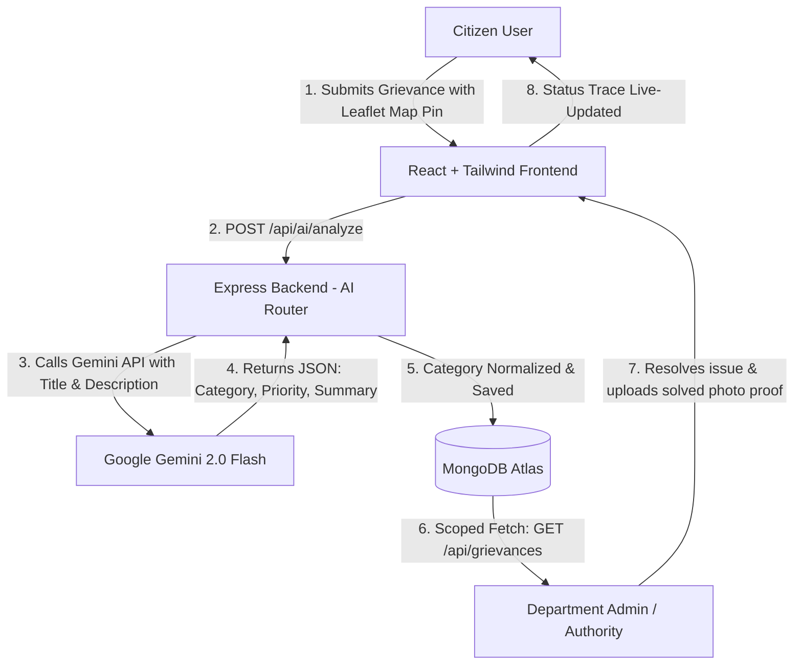

# 🏛️ Samadhaan (समाधान) - Citizen Grievance Portal

[](https://samadhaan-grievance-app.vercel.app/)
[](https://react.dev/)
[](https://nodejs.org/)
[](https://www.mongodb.com/)
[](https://deepmind.google/technologies/gemini/)

**Samadhaan** (meaning *Resolution* or *Solution*) is an AI-powered, geolocation-enabled civic action platform designed to streamline public grievance reporting, triaging, and resolution. Built on the MERN stack, the application connects citizens directly with municipal authorities, using AI to automatically route and prioritize issues.

> 🌐 **Live Application URL:** [https://samadhaan-grievance-app.vercel.app/](https://samadhaan-grievance-app.vercel.app/)
> 🖥️ **Backend API URL:** [https://samadhaangrievanceapp.onrender.com/api](https://samadhaangrievanceapp.onrender.com/api)

---

## 🗺️ System Architecture Overview

The diagram below outlines the core flow from citizen submission to AI-triage, and finally authority resolution:



---

## ✨ Key Features

### 🧑‍💼 For Citizens
- **Seamless Authentication & Guest Mode:** Secure register/login via JWT, or "Skip Login" to browse existing municipal complaints.
- **Interactive Leaflet Mapping:** Pin the precise location of any issue using an interactive Leaflet map widget with Reverse Geocoding support (via OpenStreetMap Nominatim).
- **Proximity Calculations:** Calculates the exact distance (in km) between the citizen's current location and the grievance using the Haversine formula.
- **Community Signal Boosting:** Citizens can upvote / boost signals on existing grievances to highlight collective neighborhood demands.
- **Real-Time Progress Trace:** Visual progress pipeline showing states: `Submitted` ➡️ `In Progress` ➡️ `Resolved`.

### 🧠 Intelligent AI Routing & Prioritization
- **Automated Department Categorization:** Integrates with the **Gemini 2.0 Flash API** to classify complaints into one of the designated municipal departments:
  - 🛣️ *Roads & Infrastructure*
  - 🚰 *Water Supply*
  - ⚡ *Electricity*
  - 🧹 *Waste Management*
  - 🛡️ *Public Safety*
  - 🚨 *Emergency Services*
  - 📁 *Other*
- **Severity Rating:** Automatically assigns one of four priority tiers: `Critical`, `High`, `Medium`, or `Low`.
- **Instant NLP Summarization:** AI writes a short, 1-2 sentence summary of the core issue.
- **Fail-Safe Regex Engine:** If the Gemini API is offline or the credentials are not set, a local keyword-matching algorithm executes as a backup.

### 🛡️ For Authorities & Department Admins
- **Scoped Workspaces:** Department admins are authenticated and restricted to view only complaints relevant to their specific department (e.g., Water Supply admin only sees water issues).
- **Interactive Resolution Proofing:** Authorities are required to upload a **Solved Photo Proof** (saved in base64 format in MongoDB) before changing the status to `Resolved`.
- **Quick Status Control:** Rapidly transition grievances directly from the dashboard view.

---

## 🛠️ Technology Stack

| Layer | Technology | Key Libraries / Frameworks |
|---|---|---|
| **Frontend** | React 19, Vite | TailwindCSS (PostCSS), Framer Motion, Leaflet, React-Leaflet, Lucide React, Canvas Confetti |
| **Backend** | Node.js, Express 5 | Mongoose, JSON Web Token (JWT), BcryptJS, Dotenv, CORS |
| **AI Ingestion** | Google Generative AI | Gemini 2.0 Flash API, reverse geocoding via OpenStreetMap |
| **Database** | MongoDB | Atlas Cloud Host |

---

## ⚙️ Environment Variables Config

Create a `.env` file in the root directory for the frontend and another `.env` in the `backend/` folder.

### Frontend Configurations
File: `./.env` (or `.env.production` for Vercel builds)
```env
# URL where backend is running
VITE_API_URL=http://localhost:5000/api
```

### Backend Configurations
File: `./backend/.env`
```env
# MongoDB Connection URI
MONGO_URI=mongodb+srv://<username>:<password>@cluster0.xxxxx.mongodb.net/grievance-portal?retryWrites=true&w=majority

# JWT Token Secret
JWT_SECRET=your_super_secret_jwt_random_string

# Gemini API Key (Leave empty to use local rule fallback)
GEMINI_API_KEY=AIzaSy...

# Port for local dev server
PORT=5000

# Client origin allowed by CORS
CLIENT_ORIGIN=http://localhost:5173
```

---

## 🚀 Getting Started (Local Setup)

### Prerequisites
- Node.js installed (v18+ recommended)
- MongoDB running locally or an Atlas connection string

### 1. Clone & Install Dependencies

```bash
# Clone the repository
git clone https://github.com/AgamGhotra1903/Samadhaan-Grievance-App.git
cd SamadhaanGrievanceApp-main

# Install frontend dependencies
npm install

# Install backend dependencies
cd backend
npm install
```

### 2. Configure Environment Files
Follow the [Environment Variables Config](#%EF%B8%8F-environment-variables-config) section to set up your `.env` files in both the root directory and the `backend` folder.

### 3. Run the Servers

#### Start the Backend (API Server)
```bash
cd backend
npm run dev
```
You should see:
`MongoDB Connected...` and `Server started on port 5000`

#### Start the Frontend (Vite Client)
In a new terminal window:
```bash
# From the root directory
npm run dev
```
Your browser will automatically open the application at `http://localhost:5173`.

---

## 🌐 API Reference

### User Authentication (`/api/users`)
* `POST /register` - Register a new citizen or authority user.
* `POST /login` - Log in and retrieve JWT token.

### Grievances Management (`/api/grievances`)
* `GET /` - Fetch all grievances (paginated). Automatically filters based on authority department if logged in as an admin.
* `POST /` - Submit a new grievance.
* `GET /:id` - Get details of a specific grievance.
* `PUT /:id` - Update status, upvotes, or details of a grievance. Requires solved photo upload for status `Resolved`.
* `DELETE /:id` - Delete a grievance (restricted access).
* `POST /:id/upvote` - Signal boost a grievance.

### AI Analysis Endpoint (`/api/ai`)
* `POST /analyze` - Analyze grievance title/description with Gemini AI. Returns category, priority rating, and summary.

---

## 📦 Deployment Configuration

- **Frontend:** Hosted on **Vercel** (`dist` output directory generated via Vite). Refer to [vercel.json](file:///Users/agamghotra/Downloads/SamadhaanGrievanceApp-main/vercel.json).
- **Backend:** Deployed on **Render** (Node.js service).
- **Database:** Hosted on **MongoDB Atlas** (Shared M0 cluster).

---

> [!TIP]
> **Pro Tip for Authorities:** Ensure you have high-quality, clear image proofs before attempting to mark any public grievance as **Resolved**. The system enforces validation both in the frontend and backend levels to guarantee integrity.
